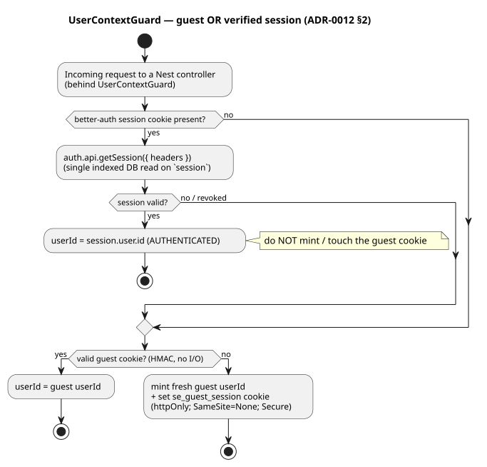
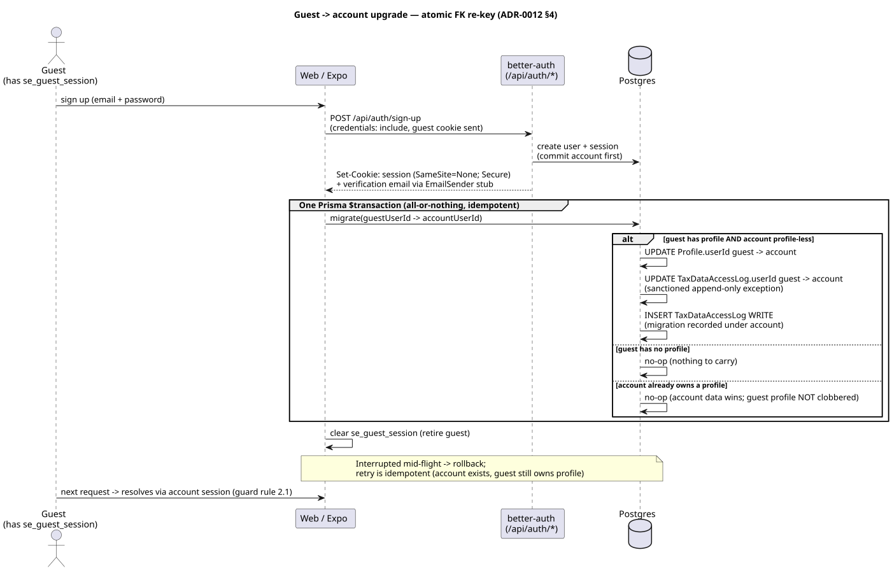

# ADR-0012 — better-auth mounting, guard guest-OR-session coexistence, and the atomic guest→account upgrade

**Status:** Accepted · 2026-07-23 · realises Slice 2 (#41 REQ-005, #46 REQ-009, #47 REQ-010, #42
REQ-006) · **extends ADR-0009** (better-auth as auth server) · honours the `UserContextGuard` seam
(ADR-0007 phase 1, REQ-002) · reconciles the session cookie with **ADR-0011** (credentialed
cross-origin) · builds on ADR-0008 (field-encrypted profile) and ADR-0010 (Postgres + boot-smoke in CI).

## Context

ADR-0009 chose **better-auth as the auth server**, mounted on the NestJS+Fastify API *behind* the
`UserContextGuard` seam, and named the phased scope (guest → email/password + upgrade → social + 2FA).
It settled the *what*. This ADR settles the *how* for the four Slice-2 tickets, i.e. the decisions the
grill surfaced that ADR-0009 deliberately left open:

1. how better-auth actually mounts on **Nest + Fastify**, and how its handler surface coexists with
   Nest's global `ValidationPipe`, `@fastify/cookie`, and Fastify's body parser;
2. how the guard derives `userId` from **either** a valid guest token **or** a verified better-auth
   session — **without touching any controller or service** (the whole point of the seam);
3. the **session cookie attributes**, reconciled with the cross-site reality ADR-0011 already forced on
   the *guest* cookie (`SameSite=None; Secure`) — ADR-0009 and REQ-009 still say `SameSite=strict`,
   which is wrong for the deployed demo and must be superseded here;
4. the **guest→account upgrade** mechanism (#42): atomic re-key of the guest's encrypted `Profile`
   (+ its `TaxDataAccessLog`) onto the new account `userId`, its edge cases, and its idempotency;
5. **hardening** (#47): rate-limit storage at scale, origin-based CSRF, the breached-password check,
   security headers — and **email delivery** for verification, which is a forward-looking provider
   choice escalated to the stakeholder while dev proceeds behind a stub seam.

Per the log's immutability rule, ADR-0009 is not rewritten; this ADR **extends** it and **supersedes
the `SameSite=strict` session-cookie wording** in ADR-0009 §Session model and in REQ-009.

## Decision

### 1. better-auth mounts as a Fastify catch-all, outside the Nest request pipeline

- The configured better-auth instance lives in **`apps/api/src/auth/better-auth.ts`** (a
  `resolve*(env)`-style factory, consistent with `resolveGuestSessionSecret` / `resolveCorsOrigins` /
  `resolveFieldEncryptionKey`; secrets `BETTER_AUTH_SECRET` / `BETTER_AUTH_URL` from env, 12-Factor III,
  never hard-coded). It is provided through a small `AuthModule` so the guard can inject it.
- better-auth's handler is a **Web-Fetch** `(Request) => Response`. It is mounted in `main.ts` (next to
  `fastifyCookie`/`enableCors`) as a Fastify **catch-all route on `/api/auth/*`**, bridging
  `FastifyRequest → Request` and `Response → FastifyReply`. Because it is a raw Fastify route, it sits
  **outside** Nest's controller pipeline — Nest's global `ValidationPipe`
  (`whitelist/forbidNonWhitelisted`) never sees better-auth bodies and cannot reject them. The auth
  routes are therefore **not** behind `UserContextGuard` (they establish identity; they don't consume
  it).
- **Body-parser coexistence:** Fastify's default JSON content-type parser must **not** consume the body
  for `/api/auth/*` before better-auth reads it. Robin disables / passes through the content parser for
  that route prefix (or reconstructs the Web `Request` from the raw stream) so better-auth owns parsing.
  This is exactly the class of wiring that `.inject()` cannot prove — it **must** be verified by the
  **real boot smoke** (ADR-0010), not unit tests.

### 2. The guard accepts guest **OR** session — precedence: verified session wins

*(source: [`0012-guard-guest-or-session.puml`](./0012-guard-guest-or-session.puml))*

`UserContextGuard` stays the **only** place `userId` is set (ADR-0007). Its resolution order becomes:

1. If a better-auth **session cookie is present**, resolve it via `auth.api.getSession({ headers })`.
   A valid session ⇒ `userId = session.user.id` (**authenticated**), and the guard does **not** mint or
   touch the guest cookie.
2. Else if a valid **guest cookie** verifies (HMAC, no I/O — unchanged) ⇒ `userId = guest`.
3. Else mint a fresh guest (unchanged).

- `canActivate` becomes **async** (`Promise<boolean>`) — Nest supports this. The guest and
  no-cookie paths stay **I/O-free** (HMAC only); a DB read happens **only** when the better-auth session
  cookie is actually present.
- **No cookie-cache initially.** better-auth's signed session-cache cookie would avoid the per-request
  DB read, but its TTL is exactly the window in which a server-side revocation is *not yet* honoured —
  and REQ-009 requires revocation to take effect **on the token's next use**. The authenticated read is
  a single indexed lookup on the `session` table (scales fine with pooling); we take that over weakening
  revocation. Cookie-cache is a **later, profile-driven** optimisation, recorded as a known lever, not
  taken now.
- Downstream is untouched: `@CurrentUser()`, controllers, services, `Profile.userId` scoping all see
  the same trusted string whether it came from a guest token or a verified session. **This is the seam
  paying off exactly as designed.**

### 3. Session + cookie model — `SameSite=None; Secure`, reconciled with ADR-0011

- **DB-backed sessions** in our EU Postgres (better-auth `user`/`session`/`account`/`verification`
  tables), server-verified and revocable, multi-device, no device registry (ADR-0009 / product ADR-027).
- **New tables only — pure expand-only migration** (ADR-047 / schema policy): no alteration to the
  existing `Profile` / `TaxDataAccessLog`. better-auth's `user.id` is a string, **the same namespace**
  as today's guest `userId`, so `Profile.userId` holds either without a type change.
- **Web cookie attributes:** `httpOnly` + `Secure` + **`SameSite=None`** — **not `strict`**. The
  deployed demo is genuinely **cross-site** (web and API on distinct `*.fly.dev` subdomains; `fly.dev`
  is a public suffix, so each subdomain is its own site — ADR-0011). A `strict`/`Lax` session cookie is
  silently dropped on the credentialed cross-site call, breaking login exactly as it would have broken
  the guest vertical. The session cookie is configured (better-auth `advanced.defaultCookieAttributes` /
  cross-subdomain settings) to match the guest cookie: **`SameSite=None; Secure`, `httpOnly`**. This
  **supersedes** the `SameSite=strict` wording in ADR-0009 §Session model and REQ-009 (`strict` was
  written for a same-origin web session; the cross-origin split forces `None`+`Secure`, per ADR-0011).
- **Expo/React-Native:** the session token is written **only to `SecureStore`**, never `AsyncStorage`,
  never `localStorage` (REQ-009). Web never exposes the token to JS (httpOnly).
- **Consequence — `SameSite=None` removes the cookie's own CSRF defence-in-depth**, which is *why*
  REQ-010's origin-based CSRF check below is load-bearing, not optional.

### 4. Guest→account upgrade — one transaction, idempotent, edge-cases explicit (#42)

At signup **from a guest session**, the request carries both the guest `userId` (guest cookie) and the
freshly created account `userId` (better-auth). The carry-over is a re-key of the ownership FK — **no
re-encryption** (the field-encryption key is app-wide, ADR-0008/0009):

*(source: [`0012-guest-account-upgrade.puml`](./0012-guest-account-upgrade.puml))*

- **In one Prisma `$transaction`:** re-assign `Profile.userId` guest→account, and re-assign every
  `TaxDataAccessLog.userId` guest→account, then **append a new `WRITE` audit entry** under the account
  `userId` recording the migration. All-or-nothing; no partial state is ever observable (REQ-006).
- **Edge cases (must be handled, each has a test):**
  - **Guest has no profile** ⇒ nothing to re-key; just retire the guest cookie and continue under the
    account. Not an error.
  - **Account already owns a profile** (e.g. a returning user who also happens to carry a guest cookie)
    ⇒ the migration **must not run** and **must not clobber** the account's own data (`Profile.userId`
    is `@unique` — a blind re-key would violate the constraint anyway). The account's data wins; the
    guest profile is left under the guest id (not silently merged). The upgrade only carries data when
    the account is **new and profile-less**.
  - **Interrupted mid-flight** ⇒ the transaction rolls back atomically; because the account already
    exists (better-auth committed it first), a retry is **idempotent**: it finds the account, sees the
    guest still owns the profile, and completes the re-key. Keyed on `(guestUserId, accountUserId)`,
    re-running never duplicates rows.
- **Retire the guest session** on success: clear the `se_guest_session` cookie so the next request
  resolves via the account session (guard precedence rule 2.1), not the stale guest token.
- **Append-only audit note:** re-keying `TaxDataAccessLog.userId` is an `UPDATE`, which the app-layer
  append-only rule (ADR-0008) otherwise forbids. This is the **single sanctioned structural exception**:
  it transfers *ownership* of a recorded fact to the account that inherits it (so REQ-011 export is
  complete for the account), it does **not** alter *what* was recorded. The migration itself is captured
  as a fresh `WRITE` entry. When DB-level append-only enforcement lands (schema follow-up), it must
  whitelist this one migration path.

### 5. Hardening (#47) — reuse better-auth's primitives; one shared origin allowlist

- **Rate limiting:** better-auth's built-in per-route login rate limiting, backed by its
  **database/secondary storage — not in-memory**, so the limit holds **across horizontally scaled API
  instances** (in-memory would reset per pod and be trivially bypassed).
- **CSRF = origin check, single source of truth:** better-auth's origin-based CSRF via `trustedOrigins`
  — wired to the **same** `resolveCorsOrigins(env)` allowlist the CORS layer uses (ADR-0011). One
  allowlist, imported in both places; **no second, drifting copy** (the single-source-of-truth rule).
  This is the primary CSRF defence given `SameSite=None`.
- **Breached-password check:** better-auth's built-in **Have I Been Pwned** plugin (k-anonymity — only a
  SHA-1 **prefix** leaves the process, never the password or PII; DSGVO-acceptable). **Reuse, not a new
  dependency** (it is part of better-auth, already sanctioned by ADR-0009). Failure policy: **a
  confirmed breach match always rejects; an HIBP outage (unreachable) fails open** with a logged warning
  — a third-party outage must not hard-block all signups. Recorded so the behaviour is a decision, not
  an accident.
- **Password policy** lives in better-auth config (min length + the breach check) — one place, imported,
  not re-implemented per screen.
- **Security headers / CSP:** `@fastify/helmet` (named in ADR-0009's hardening posture — sanctioned, not
  a casually-added dep) with a CSP disallowing inline/unsafe script; the `/docs` Swagger route is the
  known exception that needs a scoped relaxation.
- **No new casual dependencies.** better-auth, its HIBP plugin, its client SDK, and `@fastify/helmet`
  are all **pre-sanctioned by ADR-0009**. Anything beyond this set is an `ask-matt` decision, not a dev
  call.

### 6. Email delivery — dev stub behind a seam now; provider is a stakeholder decision

Verification email delivery is wired through an **`EmailSender` seam** with a
**`LoggingEmailSender`** dev/test implementation (the verification link/token is logged, never a real
send; the DS `registrierung.html` "Demo 123456" code is a mock and is **not** reproduced — the real
flow issues a real token). **Choosing the production email provider is a forward-looking, DSGVO-relevant
decision** (EU data residency for the recipient address) and is **escalated to the stakeholder via
`ask-matt`** — dev is **not** blocked: it proceeds against the stub seam, and the real provider slots in
behind `EmailSender` with no flow change.

## Consequences

- The `UserContextGuard` seam absorbs real login with **zero controller/service change** — precisely the
  property ADR-0007/0009 built it for. The only files that change to make login real are the guard,
  the new `better-auth.ts`/`AuthModule`, `main.ts` (mount + helmet), and the schema (new tables).
- The guard now performs a DB read on the **authenticated** hot path (guests stay I/O-free). Accepted
  for correct revocation; cookie-cache is the recorded lever if profiling demands it.
- The session cookie is `SameSite=None; Secure` — consistent with the guest cookie, correct for the
  cross-site demo, and the reason origin-CSRF is mandatory.
- The guest→account upgrade is atomic and idempotent, with the audit-log re-key called out as the one
  sanctioned append-only exception.
- **CI gates extend (ADR-0010):** the `integration` job runs the new REQ-005/006/009/010 acceptance +
  compliance tests against real Postgres; the `smoke` job additionally hits a real `/api/auth/*`
  endpoint over real HTTP to prove better-auth actually mounted on the Fastify adapter (the
  `.inject()`-blind class of bug). New synthetic env (`BETTER_AUTH_SECRET`, `BETTER_AUTH_URL`) is added
  to those jobs. **The lead's `APPROVE` is only an enforced invariant once branch protection (#71)
  requires these new checks — that remains the stakeholder's to set.**

## Stakeholder asks (surfaced, not decided here)

- **Email provider** (EU-resident) for verification — `ask-matt`; dev proceeds on the stub seam.
- **Branch protection (#71)** must add the new required checks (auth integration/acceptance/smoke), or
  the gate is a personal promise, not an enforced invariant.
- **REQ-011 (export/delete) is a hard gate before any real, non-synthetic user** touches this slice
  (register §sequencing). Slice 2 is built and demoed on **synthetic data**; going live to real users
  stays blocked on REQ-011.
- **2FA/passkeys (#43)** stay gated on **#49** — out of this slice.

## Alternatives considered

- **Guard uses better-auth cookie-cache to skip the DB read** — rejected for now: its TTL is a
  revocation-latency window, and REQ-009 wants revocation on next use. Revisit under load with profiling.
- **`SameSite=strict` per ADR-0009/REQ-009 as written** — rejected: silently dropped on the cross-site
  demo (ADR-0011); it would ship a login that works locally and breaks deployed, the exact gap ADR-0011
  exists to close.
- **Mount better-auth as a Nest controller** — rejected: Nest's global `ValidationPipe`
  (`forbidNonWhitelisted`) and body parsing fight better-auth's Web-Fetch handler; the raw Fastify
  catch-all keeps auth off the Nest pipeline cleanly.
- **In-memory rate limiting** — rejected: resets per pod and is bypassable across a scaled deployment;
  shared DB/secondary storage is required.
- **Merge guest data into an account that already has a profile** — rejected: silent data-merge across
  two profiles is a correctness/DSGVO hazard and violates `Profile.userId @unique`; the account's own
  data wins, the guest profile is not clobbered.
- **A dedicated transactional email provider chosen now** — deferred: it is a forward-looking,
  data-residency decision for the stakeholder, not a dev-time or lead-alone call.
