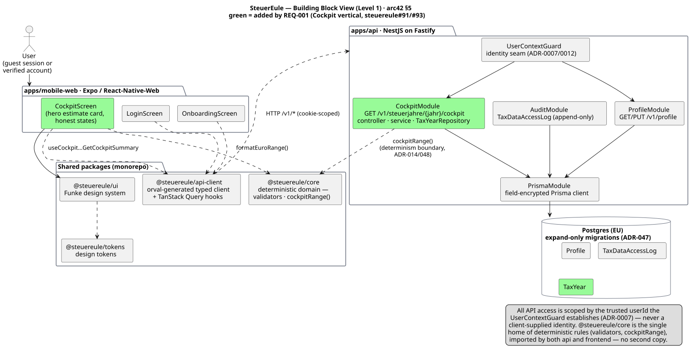
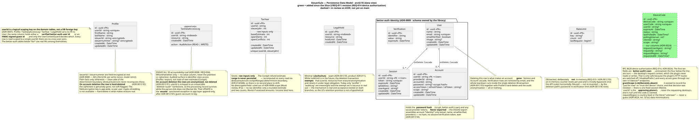
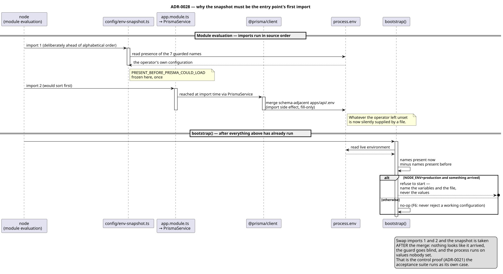

# SteuerEule — Architecture (arc42)

The living architecture document for the SteuerEule engineering build, kept as
docs-as-code alongside the [engineering ADR log](../adr/index.md). It is **as important as
the software**: a stale arc42 is treated the way we treat a failing test, and every
completed task that moves the architecture moves this document (text **and** diagrams) in
the same breath.

This is a **proportionate** arc42 — it covers the views the system actually needs today,
done well and extensible later, rather than a hollow 12-section skeleton. Sections are
added when a change first touches them; the [full arc42 template](../../Documentation/arc42doc/arc42-template.html)
remains the reference for the sections not yet populated.

Decisions live in the ADRs (this document **shows the structure**; the ADRs **justify
it** and are the source of record). Product/design decisions are cross-referenced into the
[product ADR log](../../finanzo-funke-design-system/project/research/adr/) rather than
duplicated.

## Diagrams — how they're maintained

Every diagram is authored as **PlantUML** and the `.puml` **text source is committed**
(diffable, reviewable) next to the doc; the exported **`.svg` is committed too** and the
prose references the SVG so it renders everywhere. Regenerate after any edit:

```sh
# pure-Java layout (the sources set `!pragma layout smetana`), so no Graphviz/dot needed
java -jar plantuml.jar -tsvg docs/arc42/*.puml
```

| View | Source | Rendered |
|------|--------|----------|
| §5 Building block view | [`building-block-view.puml`](./building-block-view.puml) | [`building-block-view.svg`](./building-block-view.svg) |
| §5 Data model (data view) | [`data-model.puml`](./data-model.puml) | [`data-model.svg`](./data-model.svg) |
| §8.1 Boot ordering | [`../adr/0028-boot-env-snapshot-ordering.puml`](../adr/0028-boot-env-snapshot-ordering.puml) | [`../adr/0028-boot-env-snapshot-ordering.svg`](../adr/0028-boot-env-snapshot-ordering.svg) |

**§8's toolchain half is prose-only by design:** it describes a toolchain, not a structure, and a
diagram of "which tools run in which order" would only restate the CI workflow file that already says
it. That sentence used to cover all of §8; **§8.1 is the exception it now takes**, because boot
ordering *is* a structure — an invariant about which module is evaluated before which — and it is
exactly the kind of thing prose describes badly. The diagram lives with ADR-0028 rather than being
duplicated here, and is referenced from both.

---

## 5. Building block view

Level-1 whitebox of the running system: the two apps, the shared monorepo packages, the
API's internal modules, and the EU Postgres database. Green blocks were added **since this
view's previous revision** (Slice 2's auth stack and REQ-011's DSGVO export/deletion):
REQ-014's QR device authorization (ADR-0024) and the app's **first real router** (ADR-0023).

**Dashed blocks are in review on `steuereule#239` and are not yet on `main`.** The same marker
carried `DatenschutzScreen` through `steuereule#153` and came off when that slice merged — the
map may show what is coming, but only for as long as it says so. When #239 merges, the dashes
come off these five blocks.



**Frontend — `apps/mobile-web`** (Expo / React-Native-Web). Screen-by-screen takeover
(ADR-0005, walking skeleton), now: Splash → Login/Registrierung → Onboarding → the tabbed
shell (Cockpit, Profil), with Datenschutz as a drill-down reached from Profil.
- **`App.tsx` — the composition root, and now the app's first real router** (ADR-0023):
  `@react-navigation/native` + native-stack with a `linking` config, replacing what was a
  `useState<Stage>` union. **It is the one file permitted to import `@react-navigation/*`.**
  Screens stay prop-driven — a screen never imports the router, never calls a navigation hook,
  never imports a navigation type. That constraint is not stylistic: it is what holds the test
  blast radius at 1 file instead of 15, and it is enforced at review.
- **`GeraetefreigabeScreen` — the QR approval surface** (REQ-014). It does not ask "Approve?";
  it asks whether the code shown is the one on your screen, next to the requesting browser, OS,
  region and time, and carries a standing statement that a code received by message is never
  approved here. That statement is a **control**, not reassurance: approving a code someone else
  claimed installs *their* session on *your* desktop — session fixation, not account takeover.
- `LoginScreen` additionally carries the **open QR column** (`QrMark`, the brand mark static
  inside the QR pattern's own centre, per the Funke DS's dedicated reference — #283 dropped the
  earlier animated `OwlMark` entrance once that reference existed); the code is minted on page
  load, which is a deliberate trade recorded in ADR-0024. Its own mint/poll failures classify as
  `unreachable`/`server`/`rate-limited` and drive a bounded, backing-off auto-retry — never on
  the rate-limited case, which is ADR-0024's own brake, not a bug to route around.
- `ProfilScreen` additionally carries the **device list** with per-entry revocation, and is the
  second consumer of the resolved region.
- `CockpitScreen` — hero refund-estimate card plus honest loading/empty/error states; reads
  the generated hook and formats the range with `@steuereule/core`.
- `ProfilScreen` — the stored profile, viewed and edited against the live `GET`/`PUT
  /v1/profile` (REQ-013). **Nothing sensitive is written to client storage** (ADR-0008).
- `DatenschutzScreen` — the user-facing half of REQ-011: DSGVO export (JSON + PDF) and
  account deletion with the pre-delete export offer, the Löschschutz warning, and fresh-auth
  re-verification (400/401/429/403 each a distinct, honest state) as real UI paths. On a
  successful deletion it clears both caches that could outlive the account — TanStack Query's,
  and better-auth's own session atom — so "signed out" is a state the code produces, not one
  that happens to follow.
- `exportDownload.ts` — the **one** sanctioned egress outside the generated client, drawn on
  the map rather than left inside the screen. See the api-client bullet below for why it
  exists; it is on the diagram because an undrawn second egress is how "one call site" quietly
  stops being true.
- `AuthClientProvider` — the **one** better-auth client construction site (mirrors the
  api-client's "one fetch call site" rule): session reads, sign-in/up/out, guest upgrade.
  A screen asking "is this a guest or an account?" asks *this*, so the answer is the same
  one the server would give.

**Shared packages.**
- `@steuereule/core` — the **deterministic domain**: the single home of the shape
  validators (`isValidSteuerId` / `isValidSteuernummer`) and the Cockpit range rule
  (`cockpitRange`). Imported by **both** frontend and API; there is no second copy of these
  rules (the determinism boundary, ADR-014/048).
- `@steuereule/api-client` — the orval-generated typed client + TanStack Query hooks,
  generated from `apps/api/openapi.json` (ADR-0001). Four generated targets: profile, cockpit,
  auth (capabilities) and account (export/deletion). The **one** fetch call site is its
  `httpClient` mutator, with exactly **one** documented exception: the export download
  (`exportDownload.ts`). The export body is a `Content-Disposition: attachment` — JSON *or* PDF
  bytes — and the mutator unconditionally `JSON.parse`s, which throws on a PDF; a query hook's
  cache semantics are also the wrong shape for a one-off download. The exception reuses the same
  configured origin and the same `credentials: 'include'` discipline, so what it bypasses is the
  JSON envelope, not the transport policy.
- `@steuereule/ui` / `@steuereule/tokens` — the Funke design system and its design tokens.

**Backend — `apps/api`** (NestJS on Fastify).
- **better-auth** (ADR-0009, supersedes ADR-0007's Keycloak) — mounted as a Fastify
  catch-all on `/api/auth/*`, **outside** Nest but **behind** the same trust seam: it is the
  auth *server*, not a second identity authority.
- `UserContextGuard` — still the **one** place a request's `userId` is established (ADR-0007,
  refined by ADR-0012): a verified better-auth session **or** an HMAC-signed guest cookie,
  never a client-supplied identity. Every `/v1` module scopes through it.
- `AuthModule` — capabilities endpoint (is Google actually configured?), the atomic
  guest→account upgrade (ADR-0012 §4), the `FreshAuthChecker` used by destructive actions,
  the breached-password check (REQ-010), and the `EmailSender` seam.
- **`DeviceModule` (new)** — `/v1/device/{code,pending,approve,token}` (ADR-0024). better-auth's
  `device-authorization` plugin implements RFC 8628, but its **HTTP routes are switched off**
  (`disabledPaths`) and only server-side `auth.api.*` calls reach it. Two of its behaviours force
  that seam: `/device/token` returns a Bearer token in JSON and never sets a cookie (ADR-0008/0012
  forbid holding one in JS-reachable storage), and `GET /device` claims a code for the caller's
  account while the origin check skips **all** `GET`s — reachable cross-site under our
  `SameSite=None` cookie. **Same shape as the `UserContextGuard` seam: better-auth is the
  mechanism, our API owns the surface.** Because `/device/token` sets no cookie, this module also
  writes the session cookie itself in better-auth's signed format (`session-cookie.ts`) — the one
  place where a silent upstream format change would produce a wrong signature rather than a red
  test, which is why an acceptance test round-trips it through a real better-auth instance.
- **`RegionResolver` (new)** — country-level geo-IP (ADR-0024), self-hosted in our EU deployment,
  fetched at build time and pinned by checksum; **no user IP ever leaves our infrastructure**.
  It **never guesses**: a private/unroutable address, an unlisted block, or a database past its
  refresh interval all resolve to `unknown`, rendered as "Region unbekannt". One resolver, **two
  consumers** — the approval screen and the device list — so the fallback cannot come to mean two
  different things on two screens. Country granularity is deliberate data minimisation
  (Art. 5(1)(c)).
- `ProfileModule` — `GET`/`PUT /v1/profile`.
- `CockpitModule` — `GET /v1/steuerjahre/{jahr}/cockpit`. Controller (guarded, `jahr`
  bounds-validated) → `CockpitService` → `TaxYearRepository` seam. The service reads the raw
  `TaxYear` inputs and computes the estimate range via `@steuereule/core`'s `cockpitRange()`
  — **the range is never recomputed locally or persisted**.
- **`AccountModule` (new)** — the DSGVO surface (ADR-0013): `GET /v1/account/export`
  assembles the export **once** and renders it two ways (Art. 20 JSON, human-readable
  PDF-Bericht through the `PdfRenderer` seam), reusing `ProfileRepository` so there is one
  decrypt path; `DELETE /v1/account` runs the teardown as a **single Prisma
  `$transaction`** — hard-delete `Profile`, anonymise the audit rows to an irreversible
  tombstone, delete the better-auth `User` (Session/Account cascade), exempting anything
  under an active `LegalHold`. All-or-nothing: no partial teardown is ever observable.
- `AuditModule` — the append-only `TaxDataAccessLog` (DSGVO Art. 30; the audited surface is
  identifier-class access, not read-of-own-estimate — see §Data model).
- `PrismaModule` — the shared, field-encryption-extended Prisma client (ADR-0008).
- **Cross-cutting** — the fail-closed CORS origin allowlist (ADR-0011; never `*`, credentialed
  cross-origin with `SameSite=None; Secure`), `helmet`/CSP, and the DB-backed rate limits —
  **the rate limit is not an effective control as shipped**: it is keyed on a client IP read from
  `X-Forwarded-For` with no trusted-proxy boundary, so a single-value header yields a fresh bucket
  per request ([#241](https://github.com/NexusHero/Steuereule/issues/241)). DB-backed storage fixes
  where the counter lives, not what it counts. Closes once the deployment supplies that boundary
  ([#292](https://github.com/NexusHero/Steuereule/issues/292), successor to the closed
  [#246](https://github.com/NexusHero/Steuereule/issues/246)); the Requirements Register records it
  as REQ-010 `not met (rate limiting)`. See ADR-0012 §5 and its 2026-08-04 amendment.

**Persistence — Postgres (EU)**, expand-only versioned migrations (ADR-047). Ten tables:
four `userId`-scoped domain tables, the four better-auth identity tables, `RateLimit`, and
`DeviceCode` (see the data model).

### Which decisions these blocks trace to

REQ-001 (Cockpit) introduced **no new ADR-level decision** — it was a straight application of
already-adopted patterns, and that remains true. The blocks added since then are not: they
implement decisions that were escalated and recorded first — **ADR-0009** (better-auth as the
auth server), **ADR-0012** (guard/guest coexistence and the atomic upgrade), **ADR-0011**
(credentialed cross-origin), **ADR-0010** (CI as the real gate), and **ADR-0013** (DSGVO
export/deletion, including the two stakeholder rulings: anonymise-and-retain over hard-deleting
the audit log, and JSON *and* PDF rather than either alone). This view **shows** the structure;
those ADRs **justify** it and stay the source of record.

---

## 5.1 Data model (data view)

The persisted schema (`apps/api/prisma/schema.prisma`). Green = added since the REQ-001
revision: the better-auth identity tables and `RateLimit` (Slice 2), and `LegalHold`
(REQ-011's Löschschutz seam).



- **`userId` is a logical scoping key on the domain tables, not a DB foreign key**
  (ADR-0007). `Profile` / `TaxDataAccessLog` / `TaxYear` / `LegalHold` carry **no FK** to
  `User`: the same column holds either a verified better-auth user id or an HMAC-signed guest
  id, and only the `UserContextGuard` decides which. Every row is read scoped to a single
  `userId`; there are no cross-user joins.
  **Correction (this revision):** the previous text said "there is no `User` table". That
  stopped being true when better-auth landed (ADR-0009/0012) — there *is* one, with real FKs
  among the identity tables. What survived the change is the *absence of a foreign key from
  the domain tables to it*, which is the property the guest/account seam actually depends on.
- **`Profile`** — plain onboarding facts; `steuerId` / `steuernummer` are **field-encrypted
  at rest** (ADR-0008, AES-256-GCM, per-write nonce, `mode=strict`). **Hard-deleted** on
  account deletion (ADR-0013 §2): the app-wide encryption key makes per-user crypto-shredding
  impossible, so hard-delete is what makes erasure genuine.
- **`TaxDataAccessLog`** — append-only who/what/when trail, no value column (ADR-0008 /
  REQ-004). On account deletion the rows are **anonymised, not deleted** (ADR-0013 §1): the
  `userId` is re-keyed to an irreversible tombstone, keeping the Art. 30 processing record
  while severing the person-link (Recital 26). That UPDATE is the **second** sanctioned
  structural exception to app-layer append-only, after ADR-0012 §4's guest re-key — any future
  DB-level append-only enforcement must whitelist both.
- **`LegalHold`** — the minimal Löschschutz seam (ADR-0013 §5): while `holdUntil` is in the
  future, the deletion transaction **exempts** that `(userId, resource)` and retains it under
  legal obligation. The exempt set is vacuous in real use today (no filing model persists yet),
  but the mechanism is real and acceptance-tested on both branches — which is what makes the
  UI's retention wording an honest statement rather than a hypothetical.
- **`User` / `Session` / `Account` / `Verification`** — better-auth's own schema (ADR-0009),
  the only place with real foreign keys (`Session`/`Account` cascade off `User`). `Account`
  holds the scrypt password hash and any social-provider tokens and is **never exported**: the
  DSGVO export carries account *identity* only — email, name, `emailVerified`, providers — and
  no secret of any kind (ADR-0013 §4).
- **`RateLimit`** — DB-backed on purpose (REQ-010 / ADR-0012 §5): an in-memory counter resets
  per pod and is trivially bypassed once the API scales horizontally. Reused, not re-invented,
  by the deletion path's password re-verification limit.
- **`TaxYear`** — **raw inputs only** (`baseEstimate` / `openItems` / `openConflicts`),
  unique per `(userId, steuerjahr)`. The refund-estimate range is **never persisted** —
  recomputed per read via `cockpitRange()`, so there is no second place to drift.
  **No `@encrypted` field**: ruled out of ADR-0008 scope in review — it holds no tax
  identifier, only a rounded estimate and two counts. Revisit if assessed amounts or income
  figures ever land on this entity.

---

## 8. Crosscutting concepts — the build & quality toolchain

Added because ADR-0019 is the first change to touch this layer. It records what the tools *are*
and what each one is trusted to prove; the **human** gates (refinement, review, risk-tiered test)
live in [`docs/process/delivery-pipeline.md`](../process/delivery-pipeline.md) and are deliberately
not duplicated here.

The governing principle is ADR-0010's: **a gate counts only when it runs in CI against the real
thing.** A check that runs only on a developer's machine is evidence, not a guarantee.

| Layer | Tool | What it is trusted to prove | Where it is real |
|---|---|---|---|
| Types | `tsc --noEmit`, TS **7.0.2**, `strict` + `noUncheckedIndexedAccess` + `exactOptionalPropertyTypes` | Type correctness across the workspace. Carries the **type-aware** load that the linter deliberately does not (ADR-0019 §4). | CI `test` job |
| Static lint | **oxlint** (ADR-0019) | Syntactic/semantic defect classes `tsc` does not cover — notably unused bindings (`noUnusedLocals` is **not** enabled) and shadowing across the Playwright `page.evaluate` serialisation boundary. | CI `lint` job |
| Unit / pure logic | Vitest | Behaviour of pure logic, no DB. | CI `test` job |
| Compliance | Vitest against **real Postgres** | REQ-003 field encryption at rest, REQ-004 append-only audit, REQ-005/006/009/010/011 acceptance. Never a mock (ADR-0010). | CI `integration` job |
| Boot | compiled `dist/` over real HTTP | Wiring bugs that `.inject()` is structurally blind to. | CI `smoke` job |
| Browser CORS | headless Chromium, two real origins | Credentialed cross-origin behaviour no `curl` or Node `fetch()` can enforce. | CI `cross-origin-smoke` job |
| Real-browser layout | headless Chromium, real viewports (s/m/l) | ADR-0014 breakpoint `maxWidth` resolution and the DS's `.fk-btn { width: 100% }` contract — jsdom performs no layout, so this is unprovable at the unit layer. | CI `cross-origin-smoke` job |

### Why the linter has its own parser

`typescript-eslint` is coupled to the TypeScript **compiler API**, which made the linter a hostage
to this repo's deliberate TS 7 pin — it threw at module load and the repo went its whole life
without a working static-lint gate. oxlint carries its own parser, so the same coupling cannot
recur. The lesson generalises: when a tool conflicts with the language version, **decouple the tool
from the compiler API rather than downgrade the language** (ADR-0019, *Alternatives*).

Type-aware linting is **deferred, not surrendered** — `oxlint-tsgolint` is built on typescript-go
(TS 7's own engine) and was proven to work here; it is a separate cost decision (ADR-0019 §4).

### A gate must be provably real

The `lint` job was, until ADR-0019, wired into `needs: [lint, test, integration]` while running
`echo "TODO"` — it blocked the pipeline while checking nothing and passed in ~3s on every run. A
gate carrying authority without content is worse than no gate, because it reports a safety it never
established.

The standing consequence: **every gate here must be demonstrated failing.** The evidence for a gate
is a link to a CI run that went red on a deliberately introduced defect and skipped its dependants
— not a green run, and not a local one.

> **In flight on `chore/oxlint-adoption-113`:** the `lint` row above describes the toolchain as
> decided in ADR-0019. The CI job itself is still the placeholder until Salih's wiring and its
> failing-run proof land on this branch. Following this document's convention for work in review,
> this marker comes off when that job is real — the map may show what is coming, but only for as
> long as it says so out loud.

## 8.1 Boot ordering — a structural invariant in `apps/api/src/main.ts`

Added because [ADR-0028](../adr/0028-check-the-effect-not-the-mechanism.md) is the first decision to
make module-evaluation order load-bearing. This is the one place in the system where **the order of
two import statements is an architectural constraint**, so it belongs on the map rather than only in
the file that happens to contain it.



*(source: [`0028-boot-env-snapshot-ordering.puml`](../adr/0028-boot-env-snapshot-ordering.puml))*

**The constraint:** `main.ts` imports `./config/env-snapshot.js` **first**, deliberately ahead of its
otherwise-alphabetical order. `./app.module.js` would sort first and reaches `@prisma/client` at
import time, whose generated client merges the schema-adjacent `apps/api/.env` into `process.env` as
a side effect. Once that has run, "what the operator actually supplied" is unrecoverable from inside
the process.

**What is and is not enforced, stated plainly:**

| | Status |
|---|---|
| A lint rule preventing a re-sort | **None.** `.oxlintrc.json` has no import-sort rule today. If one is ever adopted it needs an exception for this line. |
| A test that goes red when the order breaks | **Yes**, `apps/api/test/boot/assert-env-not-file-sourced.test.ts` — the acceptance case's own refusal disappears, and a derived ordering-broken entry point proves it (ADR-0021 control proof). Scope: it spawns `tsx src/main.ts`, never `dist/`. |
| The invariant holding in the compiled `dist/` | **Observed, not controlled.** Rows 1 and 2 were reproduced against `node --import tsx dist/main.js` — the `CMD` in `apps/api/Dockerfile:96` — on Node 24 against real Postgres at `ff633a3` (Salih's #310 run): the refusal fired and named the guarded vars, and the no-op case booted through to a real `GET /v1/profile` → 200. The emitted order was re-checked at `71074c6`: `tsc` puts `import './config/env-snapshot.js'` first in `dist/main.js` and emits `dist/config/env-snapshot.js`, so it neither reorders nor elides. |

**The gap that remains, stated as narrowly as it now is.** The invariant has been *seen to hold*
against the artifact production actually boots — that is more than the earlier "by construction,
untested" wording admitted, and this row is corrected here because that wording became false the day
#310 merged. What is still missing is the **control proof at that layer**: row 4 has never been run
against `dist/`, so nothing has been observed going *red* there, and both measurements above are
one-off manual runs at named commits rather than a checked-in test. By ADR-0021's own standard a
control is established only once it has been seen to fail, so the compiled path carries evidence, not
a gate. Recorded here rather than in a comment because a reader of this document should find it
without reading the entry point.
