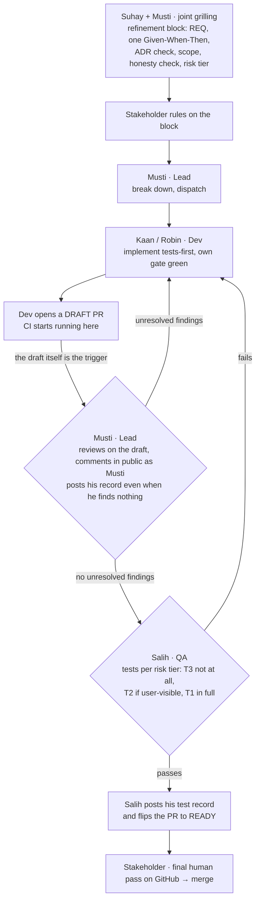

# Delivery pipeline — quality before the pull request

How a change travels from the backlog to `main`. The guiding principle is **shift-left**: the code
review and the QA test happen **before** the pull request is opened, not on it. A PR in this repo is a
**release candidate** — already reviewed, already tested, CI green — presented to the stakeholder for a
final human pass. It is never a workbench for work in progress.

This keeps two promises:

- **The stakeholder only ever receives finished PRs** — reviewed by the lead, tested by QA, green.
  Their final GitHub pass is an *audit* of the evidence, not a *discovery* of problems.
- **The GitHub history stays honest and readable** — every merged PR carries the lead's approving
  review and QA's test report, so the trail shows `Lead → QA → Stakeholder` at a glance.

## The flow



## The gates, in order

1. **Refinement — no dev starts without it, and no one half of it counts.** **Suhay and Musti grill
   it together** (ADR-0018) and the **stakeholder rules on the result**: the REQ it serves (or "new →
   into the register first"), exactly one Given–When–Then criterion, the ADRs it touches and any
   conflict, what is explicitly out of scope, **which existing product claim this change might make
   untrue**, and the risk tier. Suhay owns the story/scope/readiness half and the tier; Musti owns the
   technical design. Neither decides, because what was promised to the user is not theirs to settle.
   A refinement one of them ran alone **is not a refinement** — Kaan and Robin send back work that
   arrives without the joint block, or with only half of it.
2. **Implementation** — Kaan (frontend) / Robin (backend) build **tests-first** in their own
   branch/worktree until their own gate is green (`typecheck` + `tests` + boot proof). No mock data in
   shipped code; a slice is vertical or it isn't done (ADR-0003/0005).
3. **Draft PR — opened as soon as the dev's own gate is green.** The draft *is* the workbench, on
   purpose: the review happens on it, in the open, so the process can be watched rather than only its
   result. It also puts CI to work during the review instead of after it.
4. **Review — Musti, in public on the draft, and he starts on his own.** He reads the diff locally
   (cheaper and better than through the API) but **posts findings as comments on the PR**. He posts his
   record **even when he finds nothing** — a silent pass is indistinguishable from not having looked.
   The slice advances on **no unresolved findings**, never on "no comments". He runs **before** Salih:
   his review costs roughly a third of a real-stack run, and code sent back would invalidate that run
   anyway.

   **A draft PR opening is itself the trigger (ADR-0020). Nobody asks for permission to start the
   review, and the orchestrator does not gate it.** The trigger is the PR, not who wrote it: a draft
   from Kaan or Robin, from Salih, or from the orchestrator all start the review the same way. The rule
   exists because the alternative was tried — for one slice the orchestrator asked before each
   dispatch, and that turned the review into something waiting on a hand-off, the same "a role that has
   to be couriered is a role the process routes around" failure ADR-0017 §9 removed on the tooling
   side. The gates in this document are the process; an extra approval step in front of one of them is
   not a safety measure, it is a stall with a person standing in it.

   Two exceptions, both already stated elsewhere and neither an invitation to wait: he is **not** the
   gate on a PR he authored (§7a), and a **red CI pipeline blocks first** (gate 6) — a review of code
   that does not build is wasted.
5. **Test — Salih, risk-tiered, and he flips the switch.** **T3** (docs, DS assets, test infra,
   config): he does not run — CI covers it and there is nothing there his kind of testing catches.
   **T2**: he runs when a user can actually see or do something different. **T1** and any genuinely new
   user-facing surface: full real-stack pass. On a pass he posts his test record and **flips the draft
   to ready-for-review** — that flip is the signal that *both gates are through and it is the
   stakeholder's to merge*. Nobody else flips it.
6. **CI green.** CI re-confirms on the PR what the crew already proved locally. A red pipeline is an
   automatic block — nothing advances past it, and because the draft opened early, CI has usually
   already spoken by the time the review finishes.

   On the review *record*: Musti lands a comment ("Lead review: PASS — <what was checked>", or the
   findings if he has any), **never a formal `APPROVE`**. This is a single-account repo, so GitHub
   blocks self-approval, and a self-"APPROVE" reads as a review-gate bypass. The comment is the durable
   trail; the human merge is the only authorization.
7. **Stakeholder final pass.** The stakeholder reviews only the **ready-for-review (non-draft)** PRs —
   those, and only those, have both gates behind them. **Drafts are the crew at work and are not the
   human's to review**, though they are deliberately open to *watch*: the review thread is the point.
   So "which PRs do I review?" is answered at a glance: the non-draft queue. (Branch protection can
   require the CI **checks** but not "N reviews" — single account, nobody else to approve; the human
   merge is the gate.)

## The evidence block (required in every PR body)

```
## Evidence
- Review (Musti): <what was checked locally, why it holds> — APPROVE
- Test (Salih): <what booted; flows + breakpoints exercised; real stack vs. contract; honest
  confidence; what was NOT covered>
- Acceptance (Salih): <REQ-IDs covered → their acceptance tests, green against the real stack>
- CI: green
```

## Risk tiers — match the machinery to the risk

Not every slice needs the same weight. Applying the full grill + deep review + live 375/768/1280 test +
arc42 to a static splash screen costs as much as it does for the auth flow — and buys almost nothing.
So each slice gets a **tier**, assigned by **Suhay** at readiness (ADR-0018 moved it back to the Scrum
Master seat; Musti may bump it **up** on a risk he sees, never silently down — the assigning and the
bumping sit in different seats on purpose, so the ratchet only turns one way). The tier sets the
*depth*, never waives honesty, tests-first, DS-fidelity,
or vertical-never-mock — those hold at every tier.

| Tier | What it is | Gate depth |
|------|-----------|-----------|
| **T1 — critical** | Auth, session, encryption, money/estimates, DSGVO, anything a real user's trust or data rides on | Full: Musti technical grill **+ ADR**, tests-first, Musti local review, Salih live test (boot + flows at **375/768/1280** on the real seeded stack + REQ acceptance), **arc42** moves with it, full evidence block |
| **T2 — standard** | A normal vertical wired to an existing/contract'd surface (a screen, a CRUD endpoint) | Tests-first, Musti local review, Salih local test of the **touched** flow(s) on the real stack (not necessarily all three breakpoints unless layout is in play), evidence block. **ADR/arc42 only if the architecture actually changes.** |
| **T3 — trivial** | Static/presentational screen, DS-asset or copy sync, docs, a pure-mechanical change | Dev self-check + gate green (typecheck + tests) + a **light Musti glance** (async on the PR is fine). No live-test, no arc42, no grill. |

The tier is named on the ticket and repeated in the PR body, so the reviewer and stakeholder know which
depth to expect. When in doubt, tier **up** — the cost of over-testing a T1 is smaller than the cost of
under-testing something that turns out to touch trust or data. (A splash screen is T3; the Cockpit or
Profil vertical is T2; better-auth / encryption / the guest-upgrade transaction are T1.)

## How workers report — condensed, verdict-first

A subagent's report is not a transcript. Lead with a **verdict + a ≤10-line summary** — PASS/FAIL (or
APPROVE/REQUEST-CHANGES), what changed, and the one or two things that actually matter — then put the
detail **below**, so it can be skimmed and so it doesn't flood the orchestrator's (or the next agent's)
context. Multi-agent systems cost real tokens; a tight top-of-report is how we keep that cost down
without losing the audit trail. The **PR evidence block stays curated** (it's the durable record) — but
the working report back to the orchestrator leads with the conclusion, details on demand.

## The acceptance loop — the pipeline chases the human standard

Green CI is only as honest as its acceptance tests: the CORS defects proved "green" can lie. The fix is
a feedback loop that keeps the automated gates converging on what the stakeholder would actually
accept. ADR-0016 retired the Product Owner seat, so the human end of this loop **is** the stakeholder —
the mechanism is unchanged, but it now has exactly one person feeding it. If they stop exercising the
preview, the loop stops learning; nothing else supplies its input.

- **Salih is the platform + gate engineer, not the per-slice tester.** His top deliverables are a
  **frictionless, always-current seeded preview** (per-PR / one-command stack) that anyone can exercise,
  and **CI gates that are realistic** — every escaped bug and every stakeholder complaint becomes a permanent
  automated check against the real stack. He retires a manual check only once its automated equivalent
  is in CI and *proven* to catch the class; a thin risk-tiered exploratory pass remains for genuinely-new
  **T1** surface. **The devs own their own PR's checks to green** (Musti approves, the stakeholder
  merges) — verification parallelises across PRs instead of funnelling through one tester.
- **The stakeholder tests often, per slice, on the preview — risk-tiered.** Because Salih made testing
  one click, a **quick human sniff-test before merge on T1/user-facing slices** ("does it do what I
  meant, would a user accept it?") costs minutes of judgement, not a re-test. T3 skipped, T2
  spot-checked. It is the fast human gate on *is-this-the-real-need*, not a bottleneck.
- **The ping-pong invariant: a complaint is never just fixed — it always also becomes a test.** When
  the stakeholder finds "this didn't work" on a green build, diagnose the fork: **wrong thing built
  right** (the *criterion* was incomplete → refine it in the register) or **right thing built wrong**
  (the *test* lied → Salih hardens it). Either way the finding lands as a **new/corrected acceptance test in CI
  (red)**, a **dev** makes it green, and only then is it closed. Every round hardens the gate, so "CI
  green" asymptotically becomes "the stakeholder would accept it" — and shifting the register's
  Given–When–Then left
  into the red-first ATDD test means most of the need is automated *before* the build, leaving the loop
  to mop up only the residual.

## Rules that keep it fast

- **Two tracks, both loaded.** Suhay and Musti own capacity together (ADR-0018) — Suhay lines up the
  *ready* work, Musti shapes the technical split: work is split so the **two devs
  — Kaan (frontend) and Robin (backend) — run in
  parallel** on non-colliding slices — no dev sits idle while others build. This is the capacity that
  keeps development *fast*: the board must stay deep enough in ready, independent slices that four
  parallel tracks never starve. Planned at a **sustainable pace** (the team gets its daily breather; no
  crunch).
- **WIP limit: at most two slices in the review+test queue at once.** Four devs *build* in parallel, but
  **review (Musti) and test (Salih) are single-lane** — so building faster than they can drain just
  piles up unmergeable work (we once had five slices built and zero merged). Cap the number of slices
  waiting on the gates: when the review/test queue is full, a freed-up dev's next move is to **help land
  what's in the queue** (rebase, integrate, R2-style follow-ups, close review comments), *not* start a
  third branch. Landing finished work is throughput; a growing pile is not. Musti and the orchestrator
  hold this limit; the real speed lever is a *short* queue that drains, plus automating the gate itself
  (see risk tiers, and the CI regression gates that let a green pipeline stand in for a manual pass).
- **One ticket = one vertical slice = one short-lived branch.** Small diffs, small final pass.
- **The developer fixes — never the reviewer, the tester, or the orchestrator.** When a gate finds a
  defect, it goes back to the **dev who owns that code** to fix; it then re-enters the loop — **dev
  fixes → Musti re-reviews → Salih re-tests**, round again until it holds. Musti reviews, Salih tests,
  the dev fixes: those stay separate heads on purpose. A reviewer or tester who reaches in and patches
  the code (even a "trivial" one-liner) blurs the role and burns their context on work that isn't
  theirs — and a shortcut fix that skips the loop never gets the independent re-review + re-test that
  makes the gate mean something. So even a one-line correction routes through the dev and back around
  the loop. (The orchestrator dispatches and sequences; it does not hand-edit the code either.)
- **Every bug is fixed the moment it's found — nothing is parked for later.** A bug we find is a bug we
  fix now: before the PR opens if a local gate caught it, on the PR if CI or a reviewer caught it —
  never carried forward as "later" work. **Suhay** files a ticket for **every** finding (ADR-0018 moved
  this back to him; the reporter reports precisely, he creates, prioritises and links), but the ticket
  is the **record** (what was wrong, the fix, the proving test), not a
  deferral — it is opened *and closed* inside the slice. The only thing ever *planned* forward is
  genuine future **feature scope** (the roadmap); a known bug never is. A finding that survives past
  its slice is a process miss.
- **Every milestone yields a testable artifact + a current arc42.** "Done" is not green tests alone: a
  milestone hands the stakeholder a **valid, runnable artifact to exercise** (a one-command seeded stack / a
  preview — Salih owns it), its compliance-critical acceptance tests **run in CI against a real
  service** (not a script nothing invokes), and the **arc42 doc moves with the change** — diagrams as
  **PlantUML source + exported SVG**, kept current (Musti owns it and asks himself "is the arc42
  updated?" on every completed task). The **stakeholder** then runs a hard product-acceptance pass on
  that artifact against the Requirements Register, and its findings become tickets.
- **Nobody merges around the gates.** A PR reaches `ready` only once every gate it was owed has passed
  — Musti's review on the draft, and Salih's test where the tier calls for one; no approve on red CI;
  the stakeholder is the last gate. The stakeholder *can* merge a PR before the gates run, since he is
  the final authority on his own repository — but then the review becomes post-merge and can only
  produce tickets, never prevent the merge. That has a measured cost: it happened on #173 and a
  user-visible change went to `main` on five screens with neither gate on it.

## Who owns what

| Role | Persona | Owns in this pipeline |
|------|---------|-----------------------|
| Stakeholder (human) | NexusHero | Requirements & acceptance criteria, **ruling on the refinement block**, per-slice acceptance on the preview, the merge |
| Scrum Master | Suhay | The backlog and the board, **the story/scope/readiness half of the refinement**, risk tiers, the WIP limit, findings→tickets, the Requirements Register's state |
| Lead / Architect | Musti | **The technical half of the refinement**, **review on the draft PR**, his record, architecture docs, the right to bump a tier **up** (never down) |
| Frontend dev | Kaan | UI slices, tests-first, **opens a draft PR as soon as their own gate is green** |
| Backend dev | Robin | API/data slices, tests-first, **opens a draft PR as soon as their own gate is green** |
| DevOps / Quality-Platform | Salih | The frictionless preview, the CI gates + their **realism** (bug/complaint → permanent check), the stakeholder↔pipeline ping-pong; the risk-tiered test pass, and **the flip to ready** |

The role definitions live in [`.claude/agents/`](../../.claude/agents/); this document is the flow they
share.
