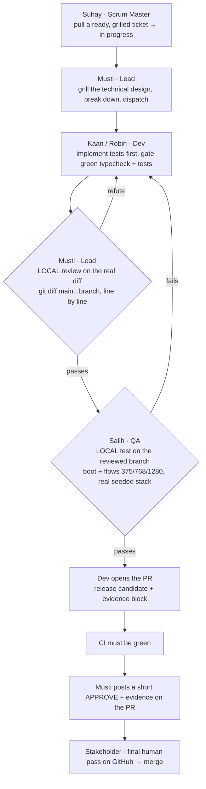

# Delivery pipeline — quality before the pull request

How a change travels from the backlog to `main`. The guiding principle is **shift-left**: the code
review and the QA test happen **before** the pull request is opened, not on it. A PR in this repo is a
**release candidate** — already reviewed, already tested, CI green — presented to the stakeholder for a
final human pass. It is never a workbench for work in progress.

This keeps two promises:

- **The stakeholder only ever receives finished PRs** — reviewed by the lead, tested by QA, green.
  Their final GitHub pass is an *audit* of the evidence, not a *discovery* of problems.
- **The GitHub history stays honest and readable** — every merged PR carries the lead's approving
  review and QA's test report, so the trail shows `Lead → QA → Stakeholder` at a glance.

## The flow



## The gates, in order

1. **Ready & grilled** — Suhay shapes and prioritises the ticket; the story/scope is grilled with
   Matthias (requirements), the technical design with Musti. A dev only ever starts *ready* work.
2. **Implementation** — Kaan (frontend) / Robin (backend) build **tests-first** in their own
   branch/worktree until the gate is green (`typecheck` + `tests`). No mock data in shipped code; a
   slice is vertical or it isn't done (ADR-0003/0005).
3. **Local review — Musti (before any PR).** Musti reads the actual diff on the branch, line by line,
   refutes directly to the dev, and iterates *off GitHub* until the code genuinely holds. Coaching
   happens here — privately, before anything is public.
4. **Local test — Salih (before any PR).** On the reviewed branch, Salih proves it **boots**, drives
   every touched flow with Playwright at 375 / 768 / 1280 px against the **real seeded stack**, and
   writes an honest confidence report (what he ran, what he did *not*). His test-pass means **every
   REQ-tagged acceptance test is green against the real stack** — see below.

### Acceptance tests — ATDD, authored from the criteria

Each REQ a slice implements gets an **executable acceptance test derived one-to-one from Matthias's
Given–When–Then criterion**, authored by Salih **early (red-first)** so it *defines* done — the
requirement drives the code. Tests are **tagged with their REQ-ID**, live at the honest level
(API-integration + Playwright E2E against the **real seeded stack**, never mocks), and feed a
**REQ↔test traceability matrix**: every REQ maps to the test(s) that prove it, and a REQ with no
proving test is a gap Salih raises to Suhay to ticket. No green-theatre (re-asserting unit tests), no
acceptance-cosmetics authored after the fact.
5. **PR opens — only now.** The dev opens the PR only once **both** local gates pass. Opening a PR is a
   promise: *review-passed + test-passed*. The PR body carries the **evidence block**.
6. **CI green + approving record.** CI re-confirms on the PR what was already locally true. Musti lands
   a concise GitHub **`APPROVE`** stating what he checked (the deep pass already happened locally) — or
   `REQUEST_CHANGES` if something regressed. A red pipeline is an automatic block.
7. **Stakeholder final pass.** The stakeholder reviews the finished, evidenced PR on GitHub and merges.
   They are the **final human gate**, not a reviewer of unfinished work.

## The evidence block (required in every PR body)

```
## Evidence
- Review (Musti): <what was checked locally, why it holds> — APPROVE
- Test (Salih): <what booted; flows + breakpoints exercised; real stack vs. contract; honest
  confidence; what was NOT covered>
- Acceptance (Salih): <REQ-IDs covered → their acceptance tests, green against the real stack>
- CI: green
```

## Rules that keep it fast

- **Two tracks, both loaded.** Suhay and Musti own capacity together: a slice is split so **Kaan
  (frontend) and Robin (backend) run in parallel** on non-colliding work — no dev sits idle while the
  other builds. Planned at a **sustainable pace** (the team gets its daily breather; no crunch).
- **One ticket = one vertical slice = one short-lived branch.** Small diffs, small final pass.
- **Blocking vs. non-blocking.** A real defect blocks and is fixed before the PR. A nice-to-have does
  **not** stall the slice — it goes to Suhay as a follow-up ticket (findings become tickets, and that
  routing is the Scrum Master's job).
- **Every milestone yields a testable artifact + a current arc42.** "Done" is not green tests alone: a
  milestone hands the PO a **valid, runnable artifact to exercise** (a one-command seeded stack / a
  preview — Salih owns it), its compliance-critical acceptance tests **run in CI against a real
  service** (not a script nothing invokes), and the **arc42 doc moves with the change** — diagrams as
  **PlantUML source + exported SVG**, kept current (Musti owns it; Suhay asks "is the arc42 updated?"
  on every completed task). The PO then runs a hard product-acceptance pass (the **User Report**) on
  that artifact, and its findings become tickets.
- **Nobody merges around the gates.** No PR without Musti's local review *and* Salih's local test; no
  approve on red CI; the stakeholder is the last gate.

## Who owns what

| Role | Persona | Owns in this pipeline |
|------|---------|-----------------------|
| Scrum Master | Suhay | Backlog, readiness, ticket state, turning findings into tickets |
| Product Owner | Matthias | Requirements & acceptance criteria, outward presentation |
| Lead / Architect | Musti | Technical grilling, **local review**, approving record, architecture docs |
| Frontend dev | Kaan | UI slices, tests-first, opens the PR once both gates pass |
| Backend dev | Robin | API/data slices, tests-first, opens the PR once both gates pass |
| Tester & DevOps | Salih | **Local test** (boot + flows), the evidence report, CI/CD health |

The role definitions live in [`.claude/agents/`](../../.claude/agents/); this document is the flow they
share.
