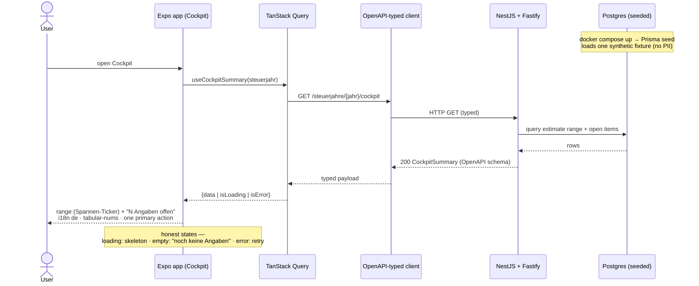

# Runtime view — REQ-001 Cockpit read flow

Sequence for the walking-skeleton read path (ultimate-dev-process §1.3). Must match the code shipping
in the REQ-001 implementation slice. Diagrams use Mermaid (project convention).

Component tests exercise the same flow with an **MSW** mock pinned to the OpenAPI contract; the
acceptance test (Playwright) runs it against the **real seeded compose stack** (e2e overlay).
